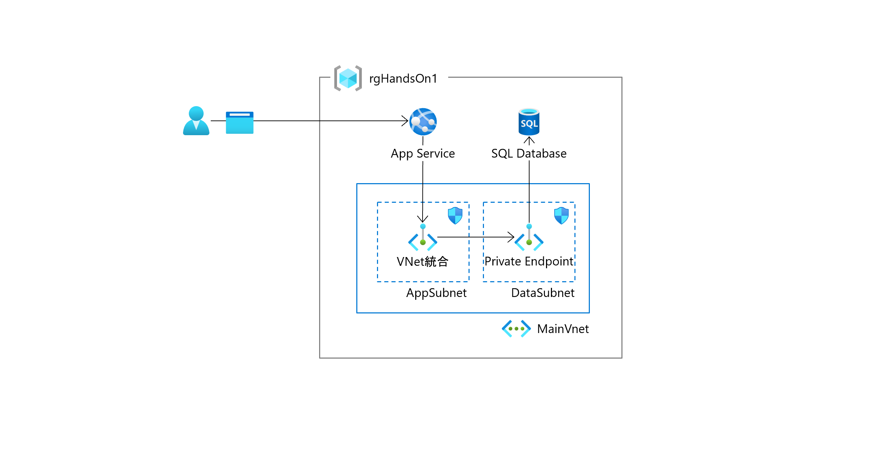

# Azure Study Hands-On

## 目次

### 事前準備

1. [事前準備](preparation01.md)

### ハンズオン

1. [AppService作成](exercise01.md)
1. [SQL Database 作成](exercise02.md)
1. [SQL Datbase のスキーマ生成](exercise03.md)
1. [App Service へアプリのデプロイ](exercise04.md)
1. [App Service スロットの活用](exercise05.md)
1. [ストリームログの設定 / 確認（オプション）](exercise06.md)
1. [閉域化（オプション）](exercise07.md)
1. 環境削除
