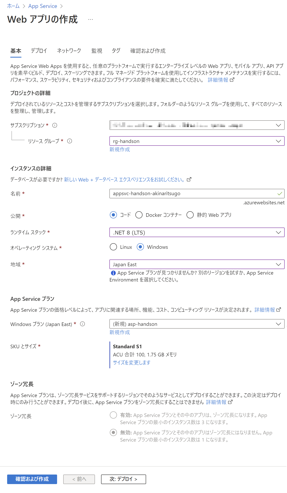
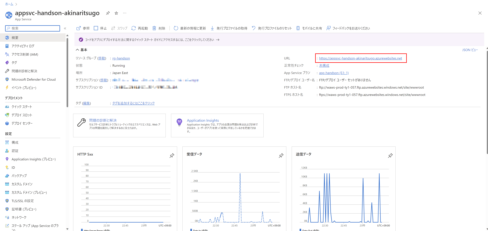
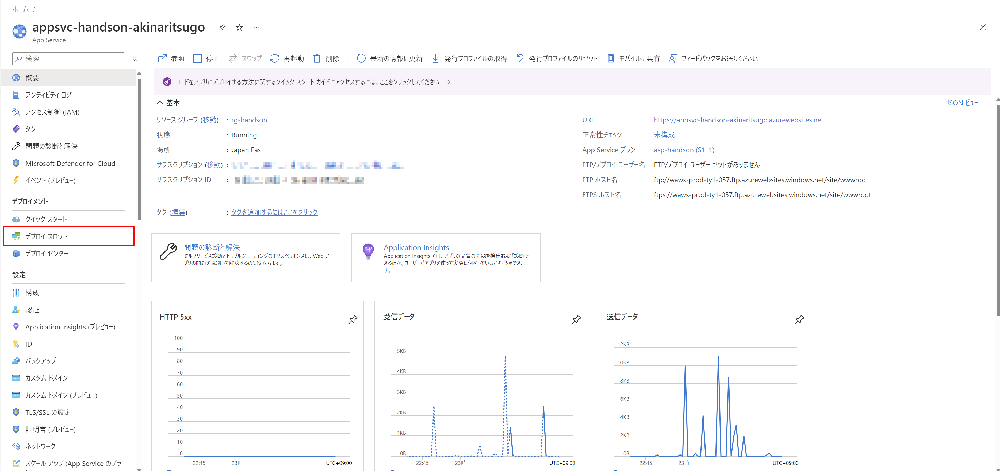
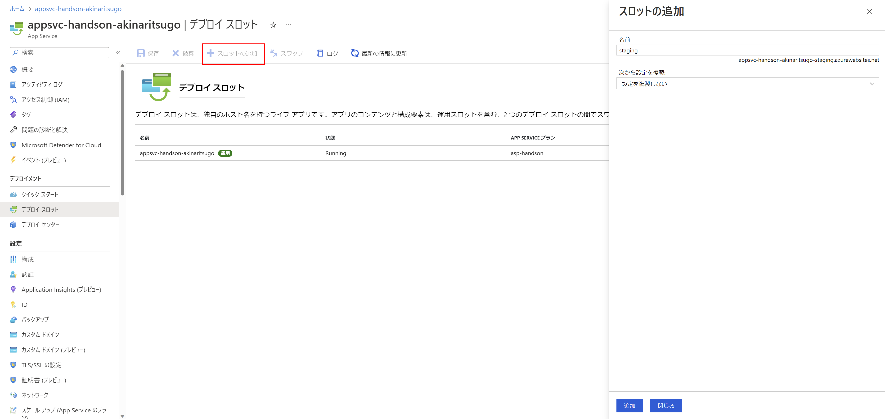
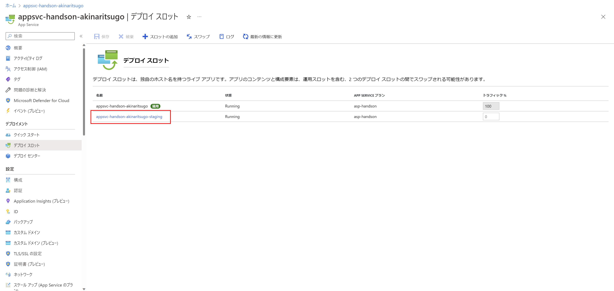
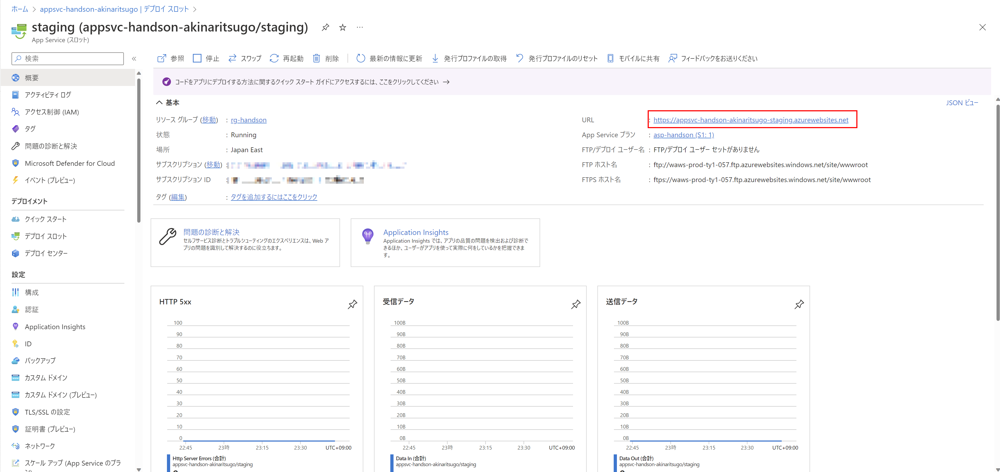

# Exercise1: AppService作成

## 【目次】

1. [App Service の作成](#app-service-の作成)
1. [App Service の動作確認](#app-service-の動作確認)
1. [デプロイスロットの作成](#デプロイスロットの作成)

## App Service の作成

1. Azureポータル上部の検索窓で「App Service」を検索、開く

1. 一覧画面上部の [作成]-[Webアプリ] を選択

1. Webアプリの作成

    1. 基本

        * プロジェクトの詳細
            * サブスクリプション： (ハンズオン用に用意したもの)
            * リソースグループ： (環境準備で作成したもの)
        * インスタンスの詳細
            * 名前： (任意。ただしグローバルで一意になる名前)
            * 公開： `コード`
            * ランタイムスタック： `.NET 8 (LTS)`
            * オペレーティングシステム： `Windows`
            * 地域： `Japan East`
        * App Service プラン
            * Windows プラン： (新規作成、任意名)
            * SKU と サイズ： `Standard S1`

        

        設定出来たら「確認および作成」を押下

    1. デプロイ~タグ

        特に指定なし

    1. 確認および作成

        内容を確認して「作成」

## App Service の動作確認

1. 作成した App Service へ移動

1. 概要欄にある URL を確認、別ブラウザで開く

    

1. 初期ページが開けばOK

    

## デプロイスロットの作成

1. 作成した App Service へ移動

1. [デプロイメント]-[デプロイスロット]を開く

    

1. 「スロットの追加」を選択してスロットを追加

    * 名前： (任意)
    * 次から設定を複製： `設定を複製しない`

    

1. 作成されたデプロイスロットを選択

    

1. 作成したスロットのURLを確認して、別ブラウザで開く

    

1. 初期ページが開けばOK

    

# 次の Exercise へ

* [SQL Database 作成](exercise02.md)
