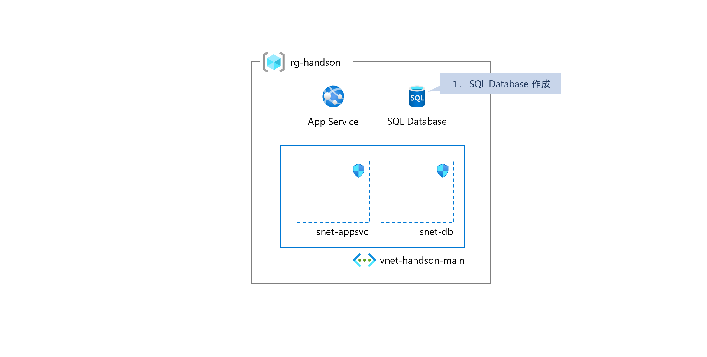
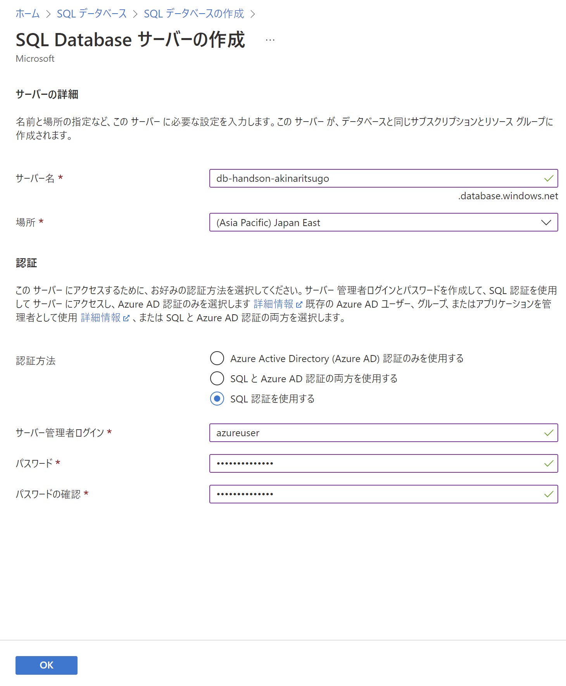
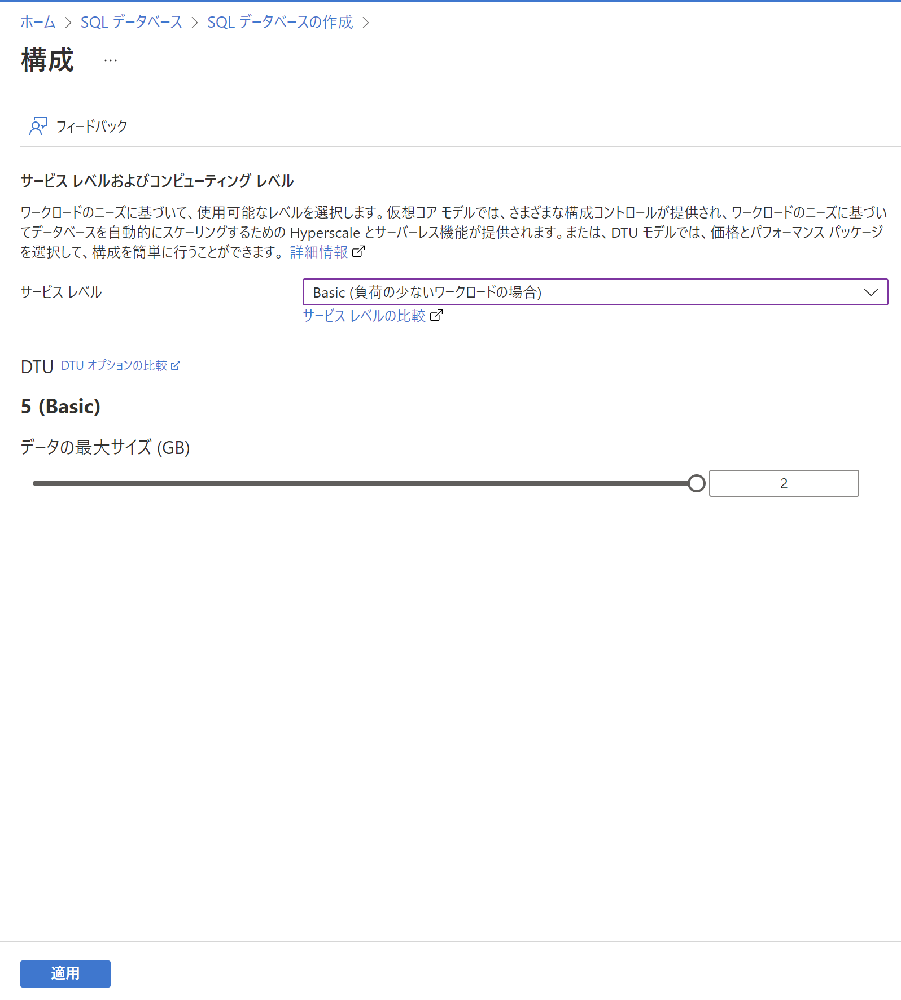
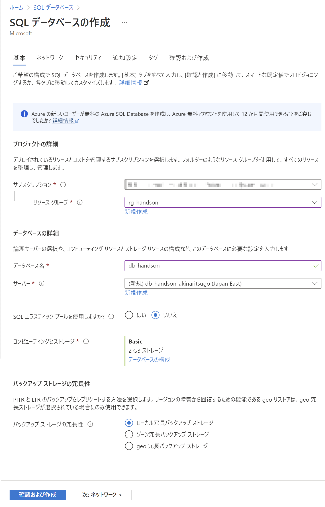
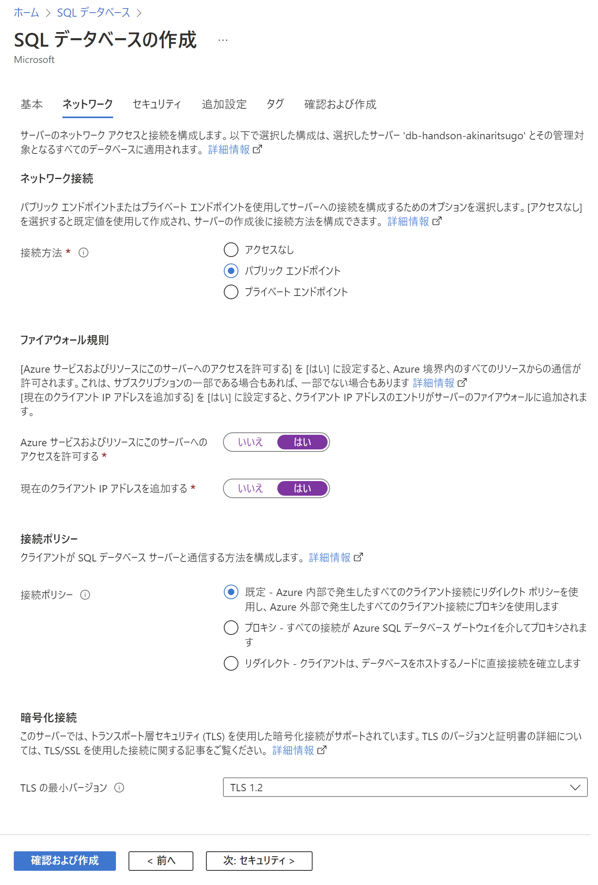
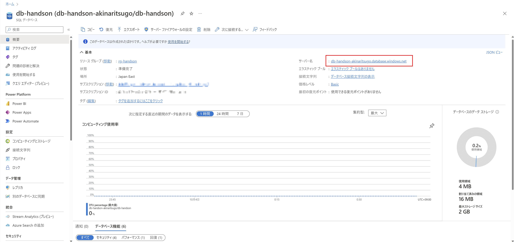
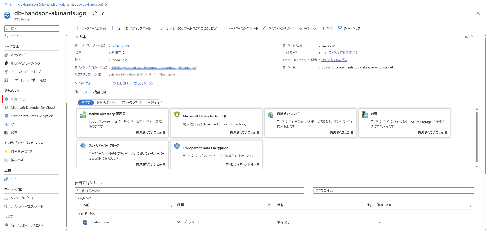
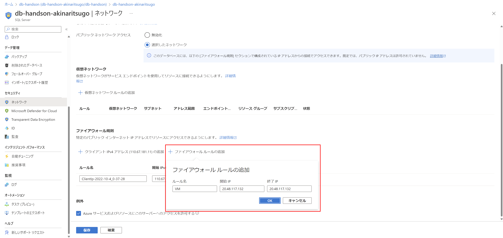

# Exercise2: SQL Database 作成

## 【目次】

1. [SQL Database 作成](#sql-database-作成)
1. [仮想マシンからのアクセス許可設定](#仮想マシンからのアクセス許可設定)

## SQL Database 作成

1.  Azureポータル上部の検索窓で「SQL データベース」を検索、開く

1. 一覧画面上部の「作成」を選択

1. SQL Database の作成

    1. 基本

        * サブスクリプション： (ハンズオン用に用意したもの)
        * リソースグループ： (環境準備で作成したもの)
        * データベース名： (任意)
        * サーバー： (新規作成 → 以下にある "SQL Database サーバーの作成" 参照)
        * SQLエラスティックプール： `いいえ`
        * コンピューティングとストレージ： `Basic 2GB` (以下にある "構成" 参照)
        * バックアップストレージの冗長性： `ローカル冗長`

        1. SQL Database サーバーの作成

            * サーバー名： (任意。重複不可)
            * 場所： `Japan East`
            * 認証方法： `SQL 認証`
            * サーバー管理者ログイン、パスワード： (任意)

            

        1. 構成

            * サービスレベル： `DTUベース` の `Basic`
            * データの最大サイズ： `2GB`
        
            

        以下は "SQL Database サーバーの作成" および "構成" を含めて設定し終わった状態

        

    1. ネットワーク

        * 接続方法： `パブリックエンドポイント`
        * ファイアウォール規則
            * Azureサービズおよびリソースにこのサーバーへのアクセスを許可する： `はい`
            * 現在のクライアントIPアドレスを追加する： `はい`
        * 接続ポリシー： `既定`
        * TLSの最小バージョン： `TLS 1.2`

        

    1. セキュリティ、追加設定、タグ

        特に設定なし（デフォルトのまま）

    1. 確認および作成

        内容を確認して「作成」

## 仮想マシンからのアクセス許可設定

1. 作成した SQL Database を開く

1. 概要にある「サーバー名」を選択

    

1. [セキュリティ]-[ネットワーク]を開く

    

1. 「ファイアウォール規則」に環境準備で作成された仮想マシンのパブリックIPアドレスを追加

    * ファイアウォール規則
        * ルール名： (任意)
        * 開始IPv4アドレス： (仮想マシンのパブリックIPアドレス)
        * 終了IPv4アドレス： (仮想マシンのパブリックIPアドレス)

    

