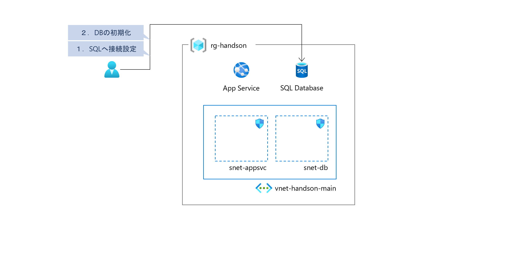
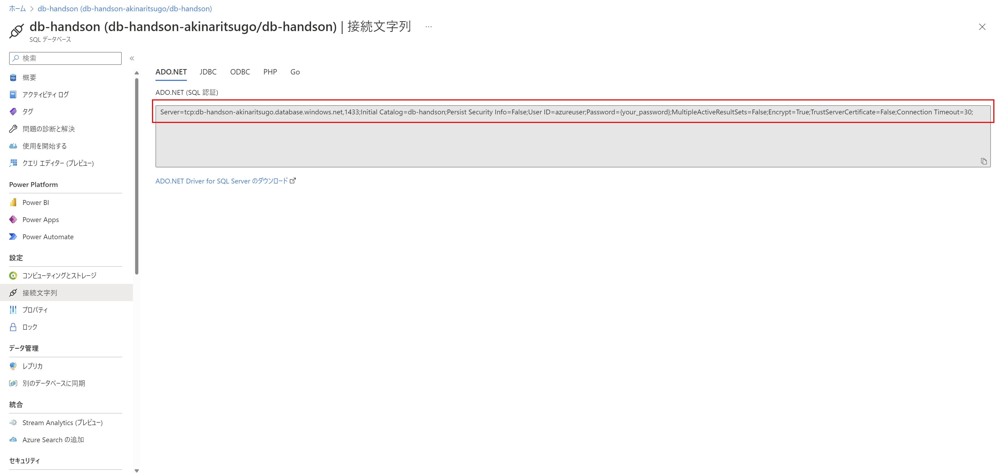
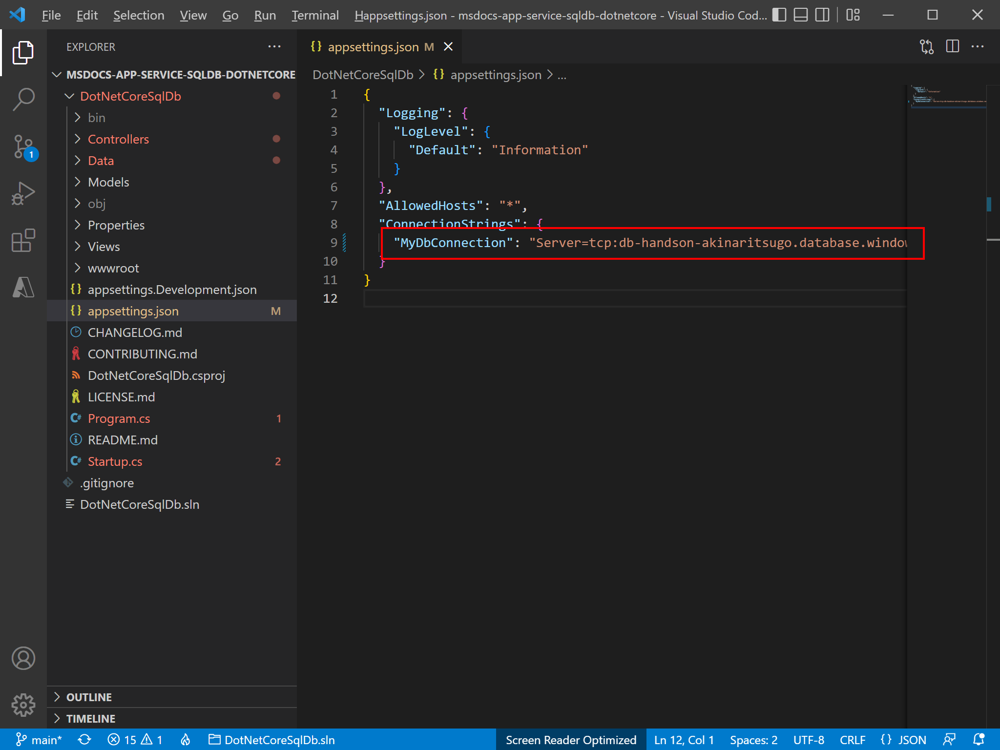
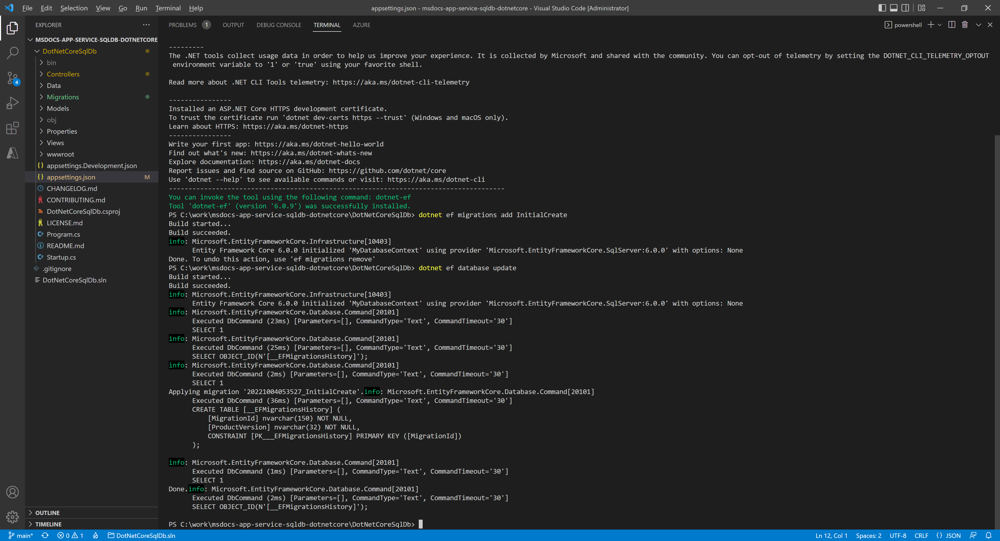
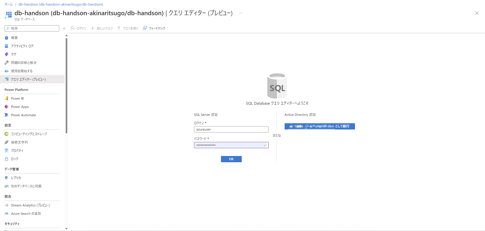
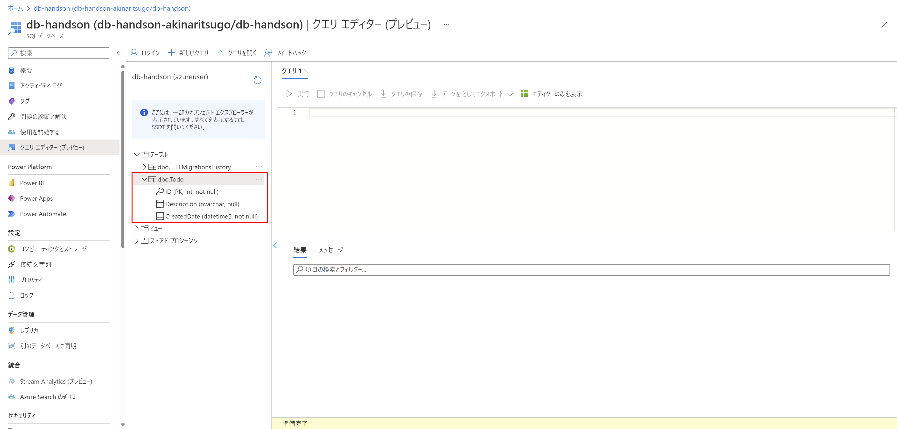

# Exercise3: SQL Database のスキーマ生成

## 【目次】

1. [SQL Database への接続文字列取得](#sql-database-への接続文字列取得)
1. [SQL Database への接続設定](#sql-database-への接続設定)
1. [SQL Database の初期化](#sql-database-の初期化)
1. [SQL Database のスキーマ確認](#sql-database-のスキーマ確認)

## SQL Database への接続文字列取得

(*) Azureポータル上で実施

1. Azure ポータルで作成した SQL Database を開く

1. [設定]-[接続文字列]を開く

1. ADO.NET の 「接続文字列」を取得

    **記載された接続文字列は「パスワード」がプレースホルダになっているので、**
    **ご自身のパスワードに書き換えを行ってから利用します。**

    

## SQL Database への接続設定

(*) 仮想マシンの中で実施

1. RDP で開発用仮想マシンへ接続

1. 環境準備にてクローンしておいたプロジェクトを Visual Studio Code で開く

1. 接続文字列を修正

    1. `/DotNetCoreSqlDb/appsettings.json` を開く

    1. `ConnectionsStrings.MyDbConnection` の値をあらかじめ取得しておいた接続文字列で書き換え

        

## SQL Database の初期化

(*) 仮想マシンの中で実施

1. RDP で開発用仮想マシンへ接続

1. 開発フォルダ移動、Visual Studio Code で開く

1. PowerShell を起動、以下のコマンドを実行

        cd .\DotNetCoreSqlDb\
        dotnet tool install -g dotnet-ef
        dotnet ef migrations add InitialCreate
        dotnet ef database update

    実行結果イメージ

    

## SQL Database のスキーマ確認

(*) Azureポータル上で実施

1. Azure ポータルへ入って作成済みの SQL Database を開く

1. [クエリエディター] を開く

1. 「SQL Server 認証」 を使ってログイン

    

1. [テーブル]-[db.Todo]を開き、スキーマが登録されていることを確認

    

# 次の Exercise へ

* [App Service へアプリのデプロイ](exercise04.md)

