# Exercise5: App Service スロットの活用

## 【目次】

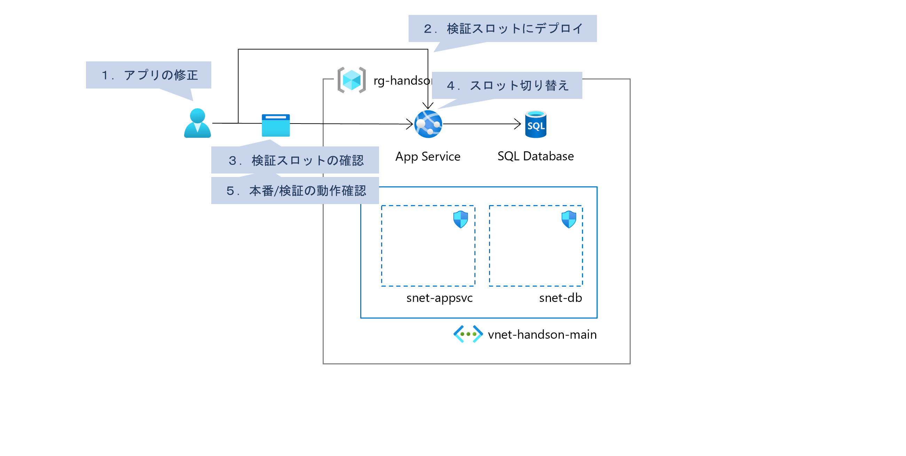

1. [アプリの修正](#アプリの修正)
1. [スロットへデプロイ](#スロットへデプロイ)
1. [スロットの確認](#スロットの確認)
1. [スロット切り替え](#スロット切り替え)
1. [本番/検証環境の確認](#本番検証環境の確認)


## アプリの修正

(*) 仮想マシン(or 開発環境) で実施


1. RDP で開発用仮想マシンへ接続

1. 環境準備にてクローンしておいたプロジェクトを Visual Studio Code で開く

1. `Index.cshtml` のタイトルなどを任意に修正

    `/DotNetCoreSqlDb/Views/Todos/Index.cshtml`

    修正前

    ```text
    ......

    <h1>Index</h1>

    ......
    ```

    修正後(例)

    ```text
    ......

    <h1>Index (2)</h1>

    ......
    ```

    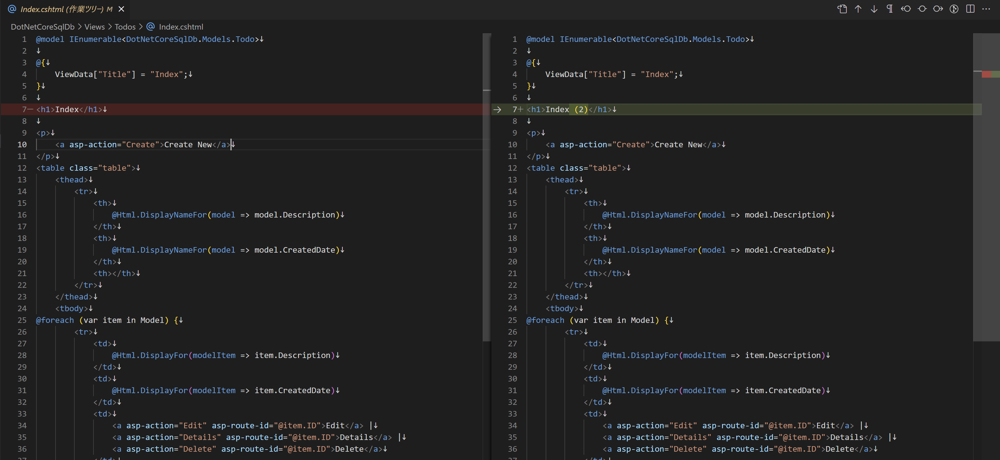


## スロットへデプロイ

(*) 仮想マシン(or 開発環境) で実施

1. Visual Studio Code 左メニューの Azure を開く

    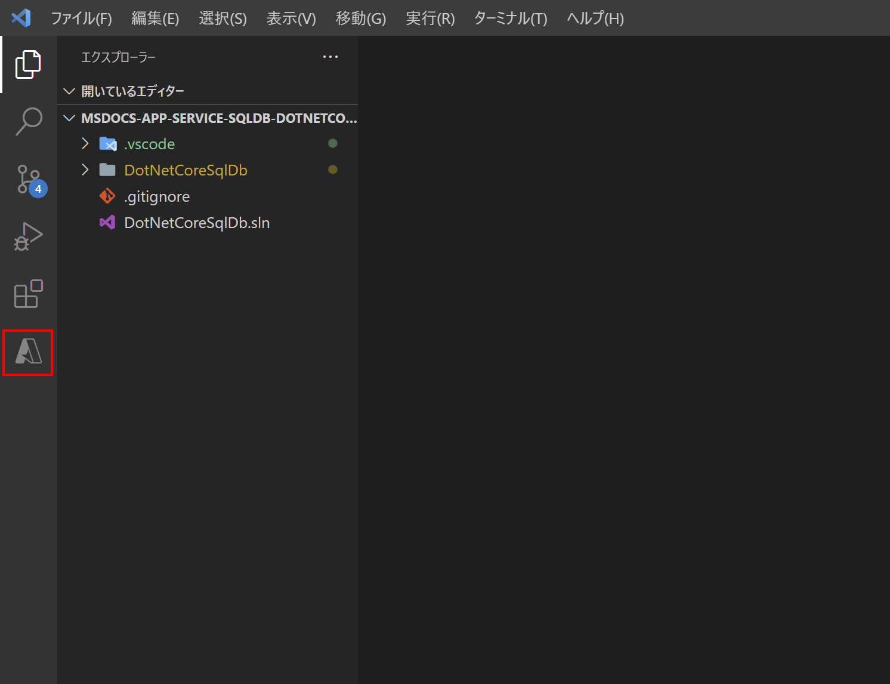

1. [サブスクリプション]-[App Services]-[環境準備で準備した App Service]-[deployment Slots] を開く

    

1. 作成済みのスロットを右クリック、「Deploy to Slot」を選択

    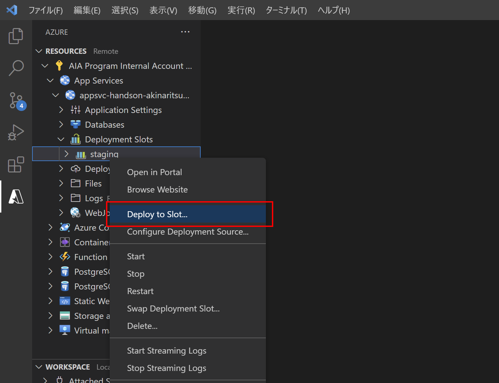


## スロットの設定

(*) Azureポータル上で実施

1. Azureポータル上で作成済みの App Service を開く

1. [デプロイメント]-[デプロイスロット]を開く

1. 作成済みのデプロイスロットを選択

1. [設定]-[環境変数] を開く

1. 「アプリ設定」タブにある「追加」を選択して、以下の環境変数を追加

    |名前|値|デプロイスロットの設定|
    |---|---|---|
    | ASPNETCORE_ENVIRONMENT | `Development` | ✓ (ON) |
    | MyDbConnection | (SQL Database への接続文字列) | ✓ (ON) |

1. 「適用」を選択、「確認」を選択して保存


## スロットの確認

(*) Azureポータル上で実施

1. Azureポータル上で作成済みの App Service を開く

1. [デプロイメント]-[デプロイスロット]を開く

    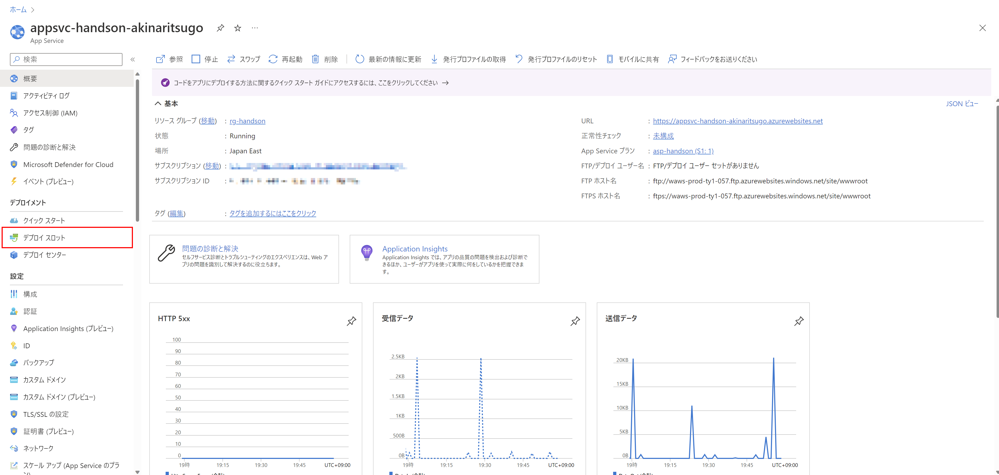

1. 作成済みの検証用スロットを開く

    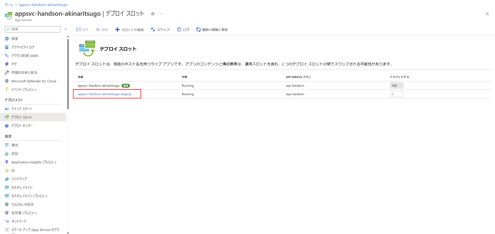

1. 概要ページにあるURLを確認

    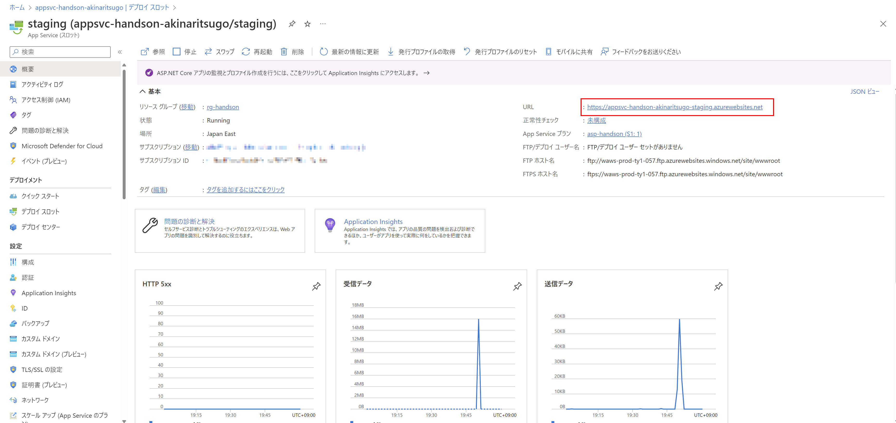

1. 別ブラウザ/タブでURLを開く

    修正内容が検証スロットに反映されていることを確認

    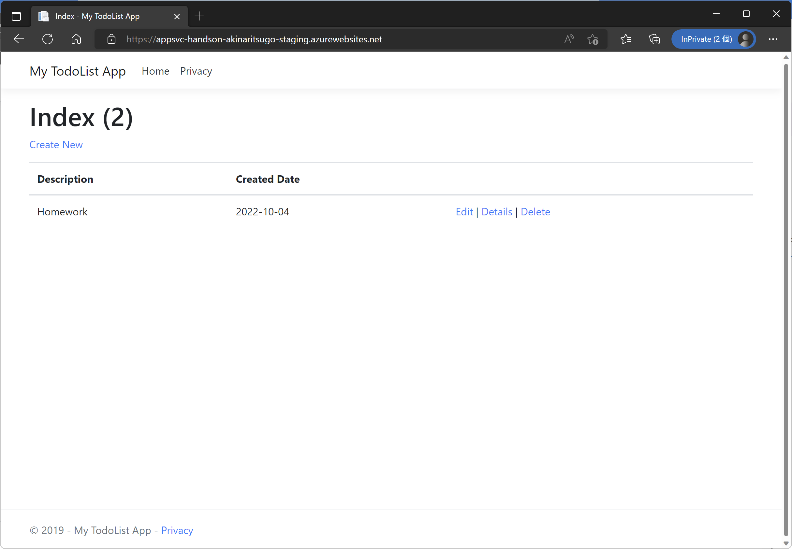


## スロット切り替え

(*) Azureポータル上で実施

1. 検証用スロットの概要にある「スワップ」を選択

    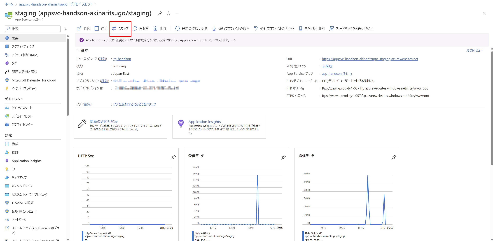

1. ソースとターゲットを確認して「スワップ」

    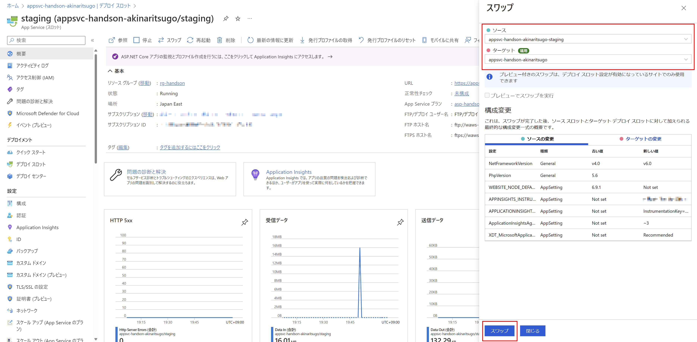


## 本番/検証環境の確認

(*) Azureポータル上で実施

1. 本番のURLを確認して開く

    1. App Service を開く
    
    1. 概要の URL を確認

        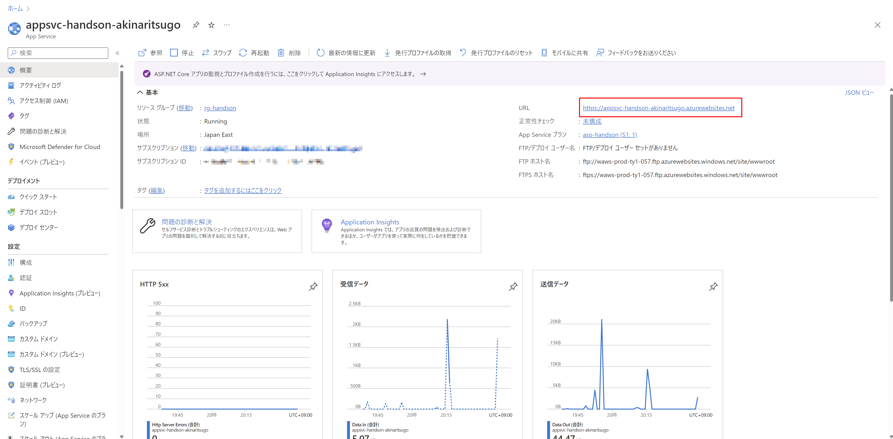

    1. 別ブラウザ/タブで開く

        修正済みのアプリが本番に切り替わっていることを確認

        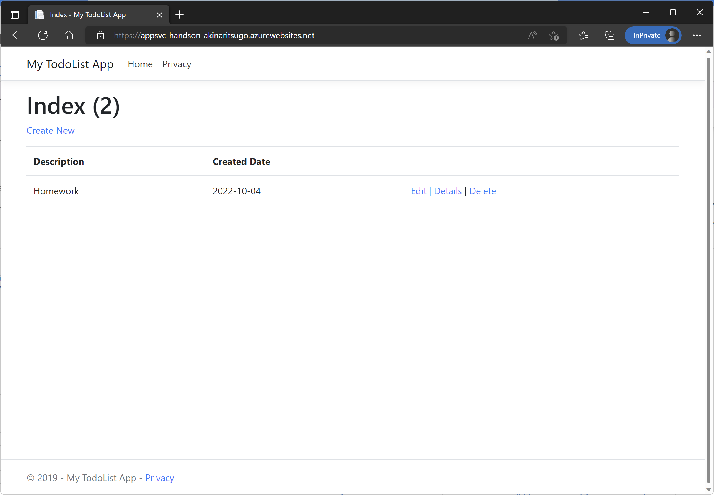

1. 検証スロットのURLを確認して開く

    1. App Service を開く

    1. [デプロイメント]-[デプロイスロット]を開く

        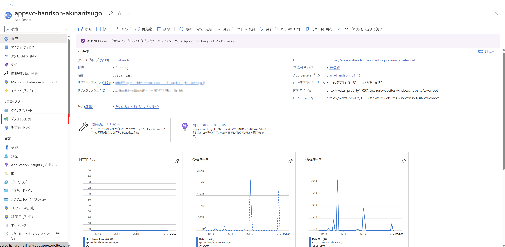

    1. 検証用スロットを開く

        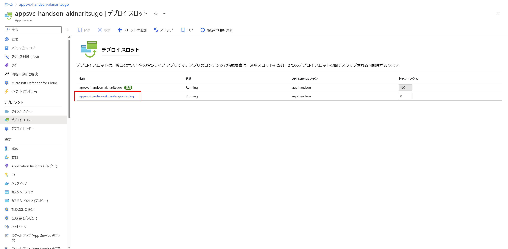

    1. 概要の URL を確認

        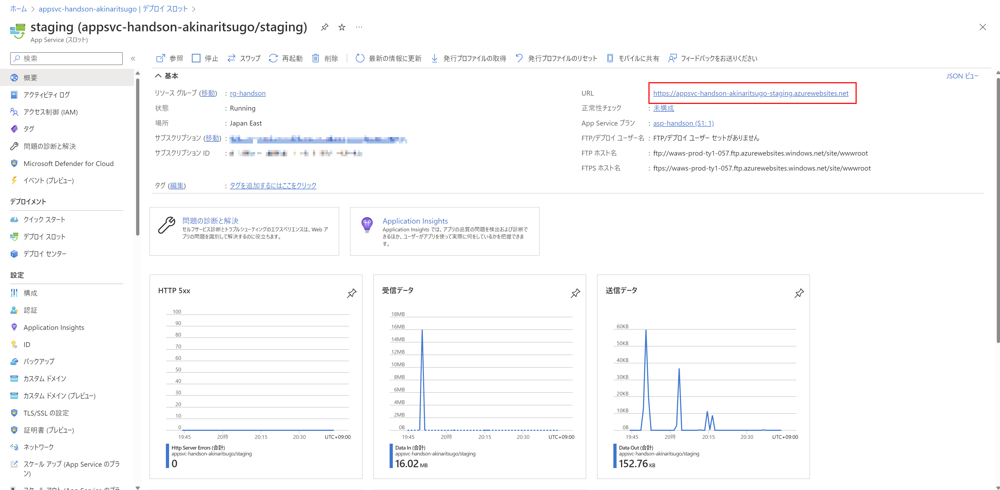

    1. 別ブラウザ/タブで開く

        もともと本番で動いていたアプリが検証スロットに入れ替わっていることを確認

        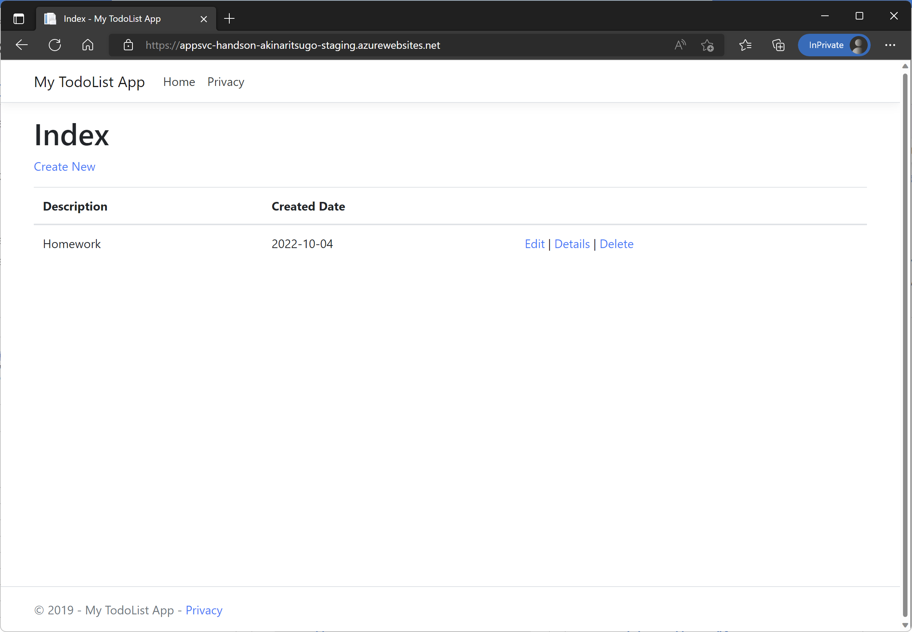


# 次の Exercise へ

* [ストリームログの設定 / 確認（オプション）](exercise06.md)


