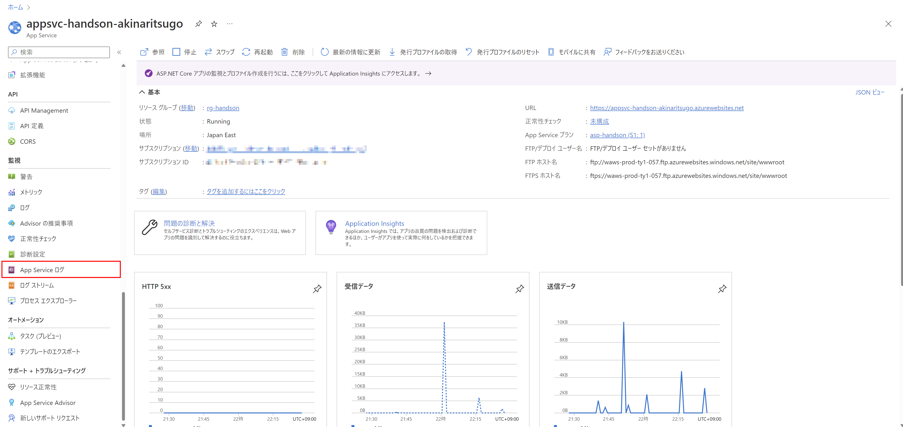
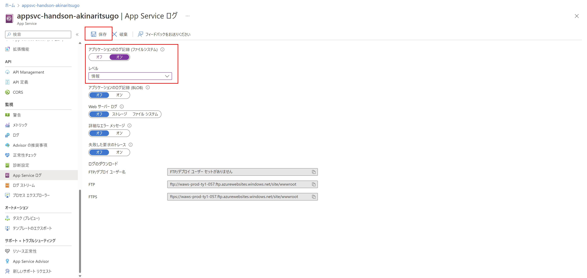
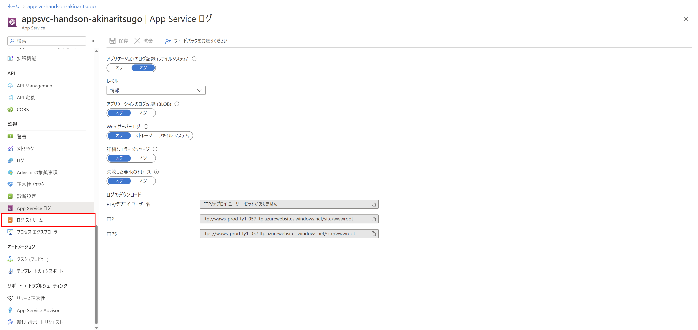
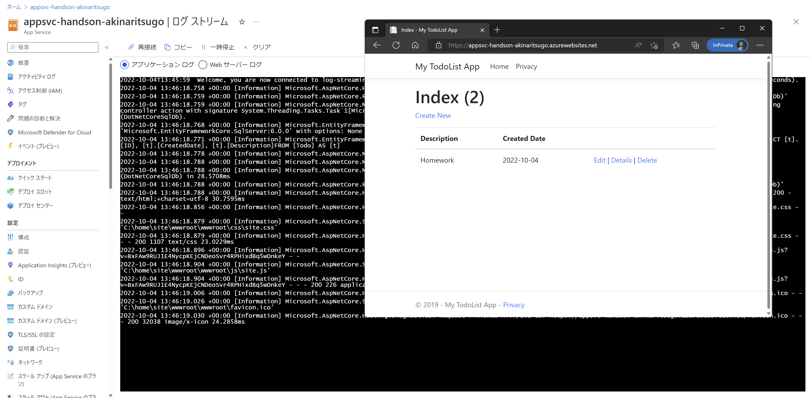

# Exercise6: ストリームログの設定 / 確認（オプション）

### ⏳ 推定時間

- 3 ~ 5分

### 🗒️ 目次

1. [ストリームログの構成](#ストリームログの構成)
1. [ストリームログの確認](#ストリームログの確認)

## ストリームログの構成

(*) Azureポータル上で実施

1. Azureポータル上で作成済みの App Service を開く

1. [監視]-[App Service ログ]を開く

    

1. 「アプリケーションのログ記録」を有効にして保存

    * アプリケーションのログ記録(ファイルシステム)： `オン`
    * レベル： `情報`

    

## ストリームログの確認

(*) Azureポータル上で実施

1. [監視]-[ログストリーム]へ移動

    

1. 別ブラウザ/タブを開いて App Service のアプリへアクセス

    アクセスした瞬間にログが表示されることを確認

    

# 次の Exercise へ

* [閉域化（オプション）](exercise07.md)
