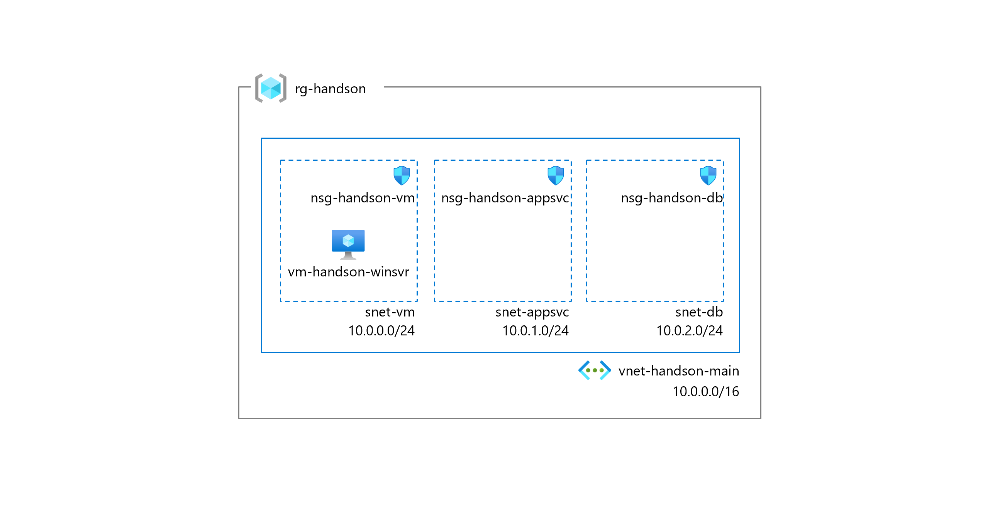

# Preparation1: 事前準備

## 【目次】

1. [インフラの展開](#インフラの展開)
1. [Windows Server の設定](#windows-server-の設定)
1. [リポジトリのクローン](#リポジトリのクローン)

## インフラの展開

1. テンプレートを利用して展開

    

## Windows Server の設定

1. RDP 接続

1. Visual Studio Code インストール

    https://code.visualstudio.com/Download

    以下の拡張機能をインストール

    <!-- * [日本語化（任意）](https://marketplace.visualstudio.com/items?itemName=MS-CEINTL.vscode-language-pack-ja) -->
    * [Azure App Service](https://marketplace.visualstudio.com/items?itemName=ms-azuretools.vscode-azureappservice)
    * [C#](https://marketplace.visualstudio.com/items?itemName=ms-dotnettools.csharp)

1. Git インストール

    https://git-scm.com/downloads

1. .NET 6 SDK インストール

    https://dotnet.microsoft.com/en-us/download/dotnet/6.0

1. SQL Server Management Studio インストール (任意)

    https://learn.microsoft.com/ja-jp/sql/ssms/download-sql-server-management-studio-ssms?view=sql-server-ver16

(*) 以下の PowerShell スクリプトを「実行コマンド」から実行するとすべてインストールされる

1. 仮想マシンを開く
1. [操作]-[実行コマンド] を開く
1. `RunPowerShellScript` を選択して、以下のコマンドを貼り付け、「実行」

        New-Item -Force -Path $env:HOMEDRIVE\temp -ItemType Directory
        cd $env:HOMEDRIVE\temp

        # Visual Studio Code
        Invoke-WebRequest -Uri https://az764295.vo.msecnd.net/stable/74b1f979648cc44d385a2286793c226e611f59e7/VSCodeSetup-x64-1.71.2.exe -OutFile VSCodeSetup.exe
        ./VSCodeSetup.exe /VERYSILENT /NORESTART /MERGETASKS=!runcode

        # Visual Studio Code - Extension
        $env:Path = [System.Environment]::GetEnvironmentVariable("Path","Machine") + ";" + [System.Environment]::GetEnvironmentVariable("Path","User")
        code --force --install-extension MS-CEINTL.vscode-language-pack-ja
        code --force --install-extension ms-azuretools.vscode-azureappservice
        code --force --install-extension ms-dotnettools.csharp

        # Git
        Invoke-WebRequest -Uri https://github.com/git-for-windows/git/releases/download/v2.37.3.windows.1/Git-2.37.3-64-bit.exe -OutFile Git.exe
        ./Git.exe /VERYSILENT /NORESTART

        # .Net 6 SDK
        Invoke-WebRequest -Uri https://dotnet.microsoft.com/download/dotnet/scripts/v1/dotnet-install.ps1 -OutFile dotnet-install.ps1
        ./dotnet-install.ps1 -Architecture x64 -Channel 6.0

        # SQL Server Management Studio
        Invoke-WebRequest -Uri https://aka.ms/ssmsfullsetup -OutFile ssmsfullsetup.exe
        ./ssmsfullsetup.exe /install /quiet /norestart /passive

        # 再起動
        Restart-Computer -Force

## リポジトリのクローン

1. 以下のリポジトリを `C:\work` 以下にクローンしておく

    (*) Git Bash を利用

        mkdir -p ${HOMEDRIVE}/work
        cd ${HOMEDRIVE}/work
        git clone https://github.com/Azure-Samples/msdocs-app-service-sqldb-dotnetcore.git
        cd msdocs-app-service-sqldb-dotnetcore

