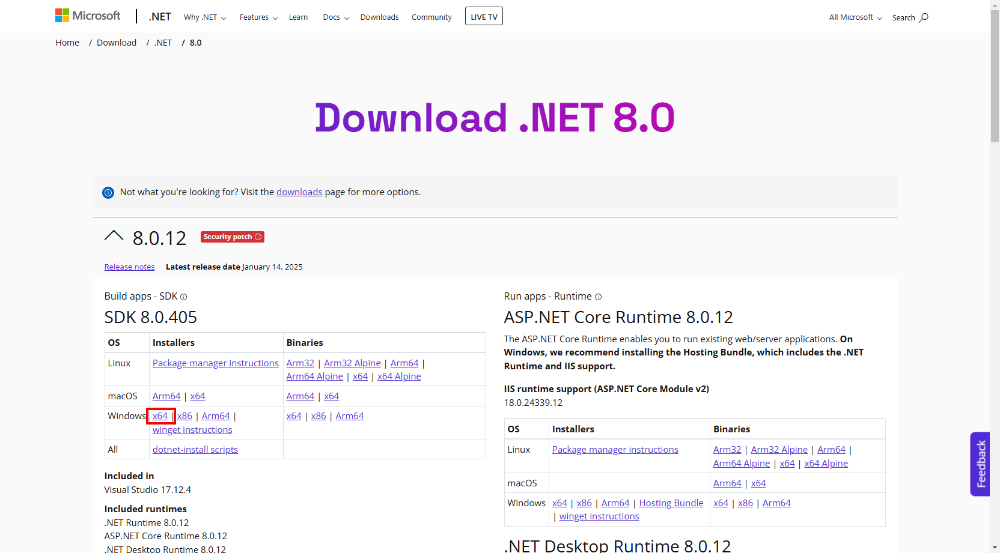

# Preparation1: 事前準備

## 【目次】


1. [インフラの展開](#インフラの展開)
1. [Windows Server の設定](#windows-server-の設定)
1. [リポジトリのクローン](#リポジトリのクローン)


## インフラの展開

1. テンプレートを利用して展開

   [](https://portal.azure.com/#create/Microsoft.Template/uri/https%3A%2F%2Fraw.githubusercontent.com%2Fakinaritsugo%2Fhandson-azurestudy-04-paas%2Fmain%2Finfra%2Ftemplate.json)

    テンプレート設定のポイント

    * サブスクリプション： (ハンズオンで利用するもの)
    * リソースグループ： (任意。同一サブスクリプション共用する場合、重複しないよう注意)
    * リージョン： `Japan East`
    * Virtual Machine Admin Username： (任意。VMのログインID)
    * Virtual Machine Admin Password： (任意。VMのログインパスワード)


## Windows Server の設定

1. RDP 接続

    1. Azureポータルにて、起動済みの仮想マシンを開く

    1. [概要]-[パブリックIPアドレス]を確認

        

    1. RDPを起動して接続

        接続できない場合、仮想マシンが所属するサブネットのセキュリティグループ `nsg-handson-vm` を確認

        必要に応じて RDP ( `TCP 3389` ) の受信ができるように設定する

1. 仮想マシンに以下を順番にインストール

    * Visual Studio Code および 拡張機能
    * Git
    * .Net 6.0 SDK
    * SQL Server Management Studio (任意)

    インストーラーは以下の通り

    1. Visual Studio Code インストール

        https://code.visualstudio.com/Download

        ダウンロードするインストーラー

          * `Windows 8, 10, 11 用`
          * `System Installer 64bit`

          

        以下の拡張機能をインストール

        <!-- * [日本語化（任意）](https://marketplace.visualstudio.com/items?itemName=MS-CEINTL.vscode-language-pack-ja) -->
        * [Azure App Service](https://marketplace.visualstudio.com/items?itemName=ms-azuretools.vscode-azureappservice)

            

        * [C#](https://marketplace.visualstudio.com/items?itemName=ms-dotnettools.csharp)

            


    1. Git インストール

        https://git-scm.com/download/win

        ダウンロードするインストーラー

          * `SDK 6.0.402 Windows x64`

            


    1. .NET 6 SDK インストール

        https://dotnet.microsoft.com/en-us/download/dotnet/6.0

        ダウンロードするインストーラー

          * `64-bit Git for Windows Setup`

            

    1. SQL Server Management Studio インストール (任意)

        https://learn.microsoft.com/ja-jp/sql/ssms/download-sql-server-management-studio-ssms?view=sql-server-ver16

        

<!-- 
(*) 以下の PowerShell スクリプトを「実行コマンド」から実行するとすべてインストールされる

1. 仮想マシンを開く
1. [操作]-[実行コマンド] を開く
1. `RunPowerShellScript` を選択して、以下のコマンドを貼り付け、「実行」

    コマンド実行を利用する場合、タイムアウトするので順番に実行する。

    1. Visual Studio Code インストール

            New-Item -Force -Path $env:HOMEDRIVE\temp -ItemType Directory
            cd $env:HOMEDRIVE\temp

            # Visual Studio Code
            Invoke-WebRequest -Uri https://az764295.vo.msecnd.net/stable/74b1f979648cc44d385a2286793c226e611f59e7/VSCodeSetup-x64-1.71.2.exe -OutFile VSCodeSetup.exe
            ./VSCodeSetup.exe /VERYSILENT /NORESTART /MERGETASKS=!runcode

    1. Visual Studio Code 拡張機能 インストール

            # Visual Studio Code - Extension
            $env:Path = [System.Environment]::GetEnvironmentVariable("Path","Machine") + ";" + [System.Environment]::GetEnvironmentVariable("Path","User")
            code --force --install-extension MS-CEINTL.vscode-language-pack-ja
            code --force --install-extension ms-azuretools.vscode-azureappservice
            code --force --install-extension ms-dotnettools.csharp

    1. Git インストール

            New-Item -Force -Path $env:HOMEDRIVE\temp -ItemType Directory
            cd $env:HOMEDRIVE\temp

            # Git
            Invoke-WebRequest -Uri https://github.com/git-for-windows/git/releases/download/v2.37.3.windows.1/Git-2.37.3-64-bit.exe -OutFile Git.exe
            ./Git.exe /VERYSILENT /NORESTART

    1. .Net 6 SDK インストール

            New-Item -Force -Path $env:HOMEDRIVE\temp -ItemType Directory
            cd $env:HOMEDRIVE\temp

            # .Net 6 SDK
            Invoke-WebRequest -Uri https://dotnet.microsoft.com/download/dotnet/scripts/v1/dotnet-install.ps1 -OutFile dotnet-install.ps1
            ./dotnet-install.ps1 -Architecture x64 -Channel 6.0

    1. SQL Server Management Studio インストール

            New-Item -Force -Path $env:HOMEDRIVE\temp -ItemType Directory
            cd $env:HOMEDRIVE\temp

            # SQL Server Management Studio
            Invoke-WebRequest -Uri https://aka.ms/ssmsfullsetup -OutFile ssmsfullsetup.exe
            ./ssmsfullsetup.exe /install /quiet /norestart /passive

    1. すべて完了したら再起動する

        # 再起動
        Restart-Computer -Force
-->

## リポジトリのクローン

以下のリポジトリを `C:\work` 以下にクローンします。

```
https://github.com/Azure-Samples/msdocs-app-service-sqldb-dotnetcore.git
```

1. `C:\work` フォルダを作成

1. 作成したフォルダで右クリック→[Git Bash here]を選択

    

1. 以下のコマンドを実行

        git clone https://github.com/Azure-Samples/msdocs-app-service-sqldb-dotnetcore.git

    
